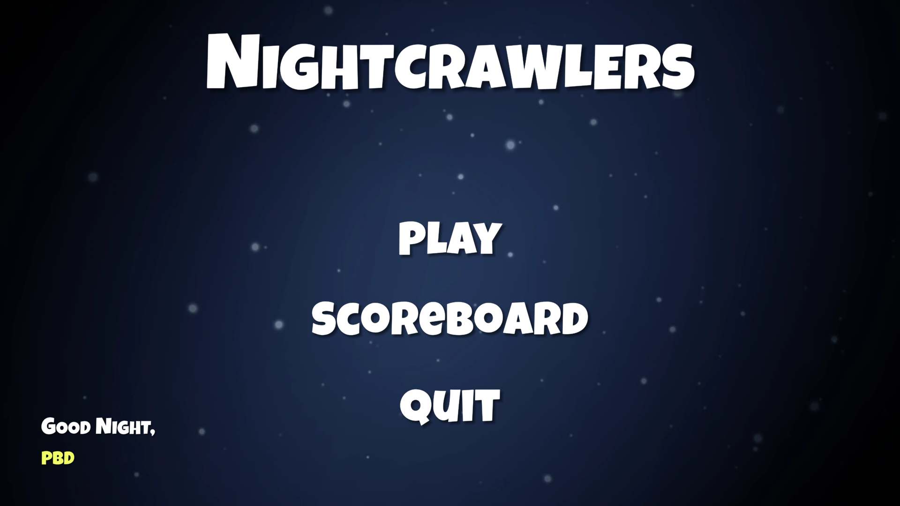
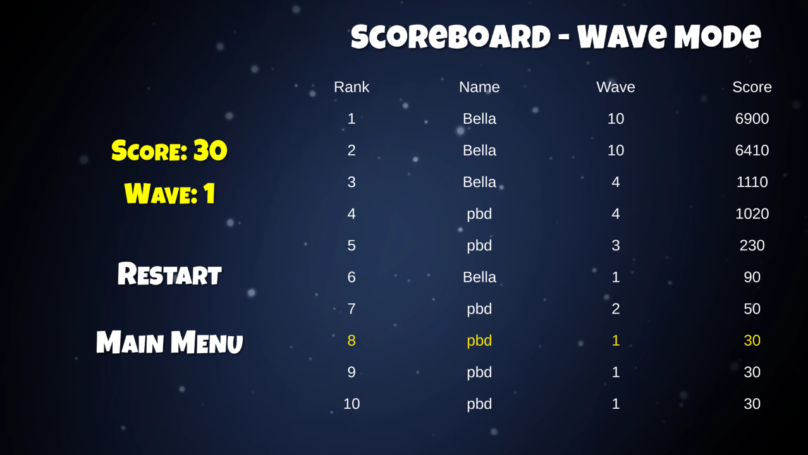
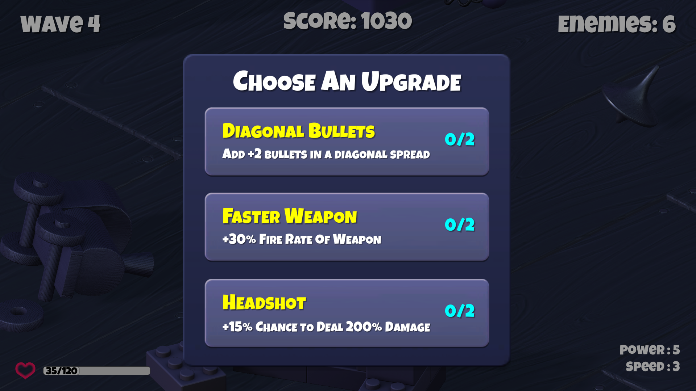
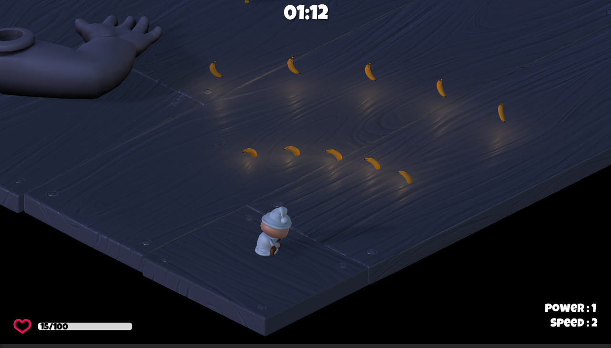
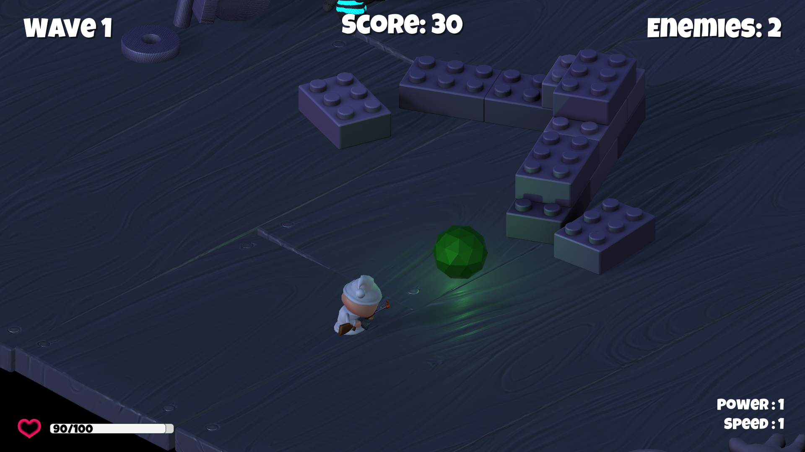

# Deskripsi Aplikasi
Aplikasi ini merupakan suatu video game yang dibuat menggunakan Unity. Game ini dikembangkan sebagai lanjutan dari tutorial Unity Survival Shooter. Game dikembangkan lebih dengan menambahkan fitur-fitur seperti main menu, local scoreboard, game modes (Wave dan Endless), mobs-mobs baru, player attributes, weapon upgrades, pause menu, layar game over, dan lain-lain. 
# Cara Kerja
### Dari Unity Editor
- Buka directory `Survival Shooter` dari program ini melalui Unity Editor, pastikan versi Unity Editor yang dipakai sama untuk menghindari permasalahan
- Buka scene `Menu` lalu tekan tombol Play
- Anda bisa juga melakukan Build dari Unity Editor lalu run hasil build tersebut
# Library 
| Nama     | Alasan |
| ----------- | ----------- |
| TextMeshPro | Mempermudah dalam desain GUI terutama untuk text|
| [Asset Ayam](https://assetstore.unity.com/packages/3d/characters/animals/meshtint-free-chicken-mega-toon-series-151842) | Asset untuk mob tipe bomber |
|[Asset Naga](https://assetstore.unity.com/packages/3d/characters/creatures/dragon-the-soul-eater-and-dragon-boar-77121)| Asset untuk mob tipe skeleton|
|[Asset Kumbang Alien](https://assetstore.unity.com/packages/3d/characters/creatures/meshtint-free-polygonal-metalon-151383)| Asset untuk mob tipe boss|
|[Asset Skull Mask](https://kaylousberg.itch.io/kaykit-animations)| Asset untuk mob tipe Reaper|
|[Asset Pisang](https://assetstore.unity.com/packages/3d/food-pack-3d-microgames-add-ons-163295)| Asset untuk peluru|
|[Unity Particle Pack](https://assetstore.unity.com/packages/essentials/tutorial-projects/unity-particle-pack-127325)|Particle Effect dari hal-hal yang ada di game seperti napas api naga|
|[Asset Orb](https://assetstore.unity.com/packages/3d/props/simple-gems-ultimate-animated-customizable-pack-73764)| Asset untuk orb|

# Screenshot Aplikasi
- Main Menu

- Scoreboard

- Change Player Name

- Game Mode Menu

- Endless Mode

- Wave Mode

- Bomber Mob (Ayam)

- Skeleton Mob (Naga)

- Boss Mob (Kumbang Alien)

- Reaper Mob

- Game Over

- Result Screen

- Upgrade Menu

- Bullets

- Player Attribute Orb

# Pembagian Kerja
Isabella Handayani - 13519081
- Additional Mobs - Skeleton
- Additional Mobs - Bomber
- Additional Mobs - Boss
- Additional Mobs - Reaper
- Game Mode - Wave
- Game Mode - Endless

Alexander - 13519090
- Player Attributes
- Orbs
- Weapon Upgrade - Diagonal Shot
- Weapon Upgrade - Faster Weapon
- Bullet
- Object Pooling (Bonus)

Girvin Junod - 13519096
- Main Menu
- Pause Menu
- Game Over + Player Results
- Scoreboard
- Weapon Upgrade Menu
- Weapon Upgrade - Critical Damage (Bonus)
